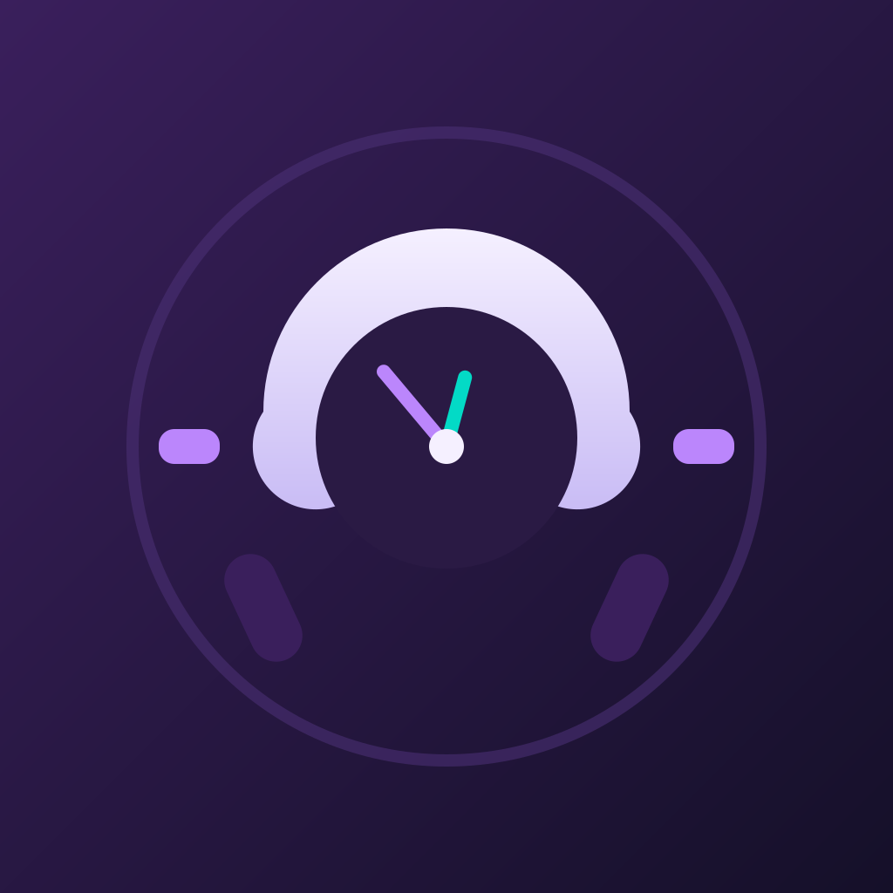
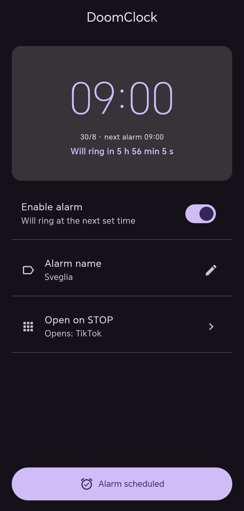
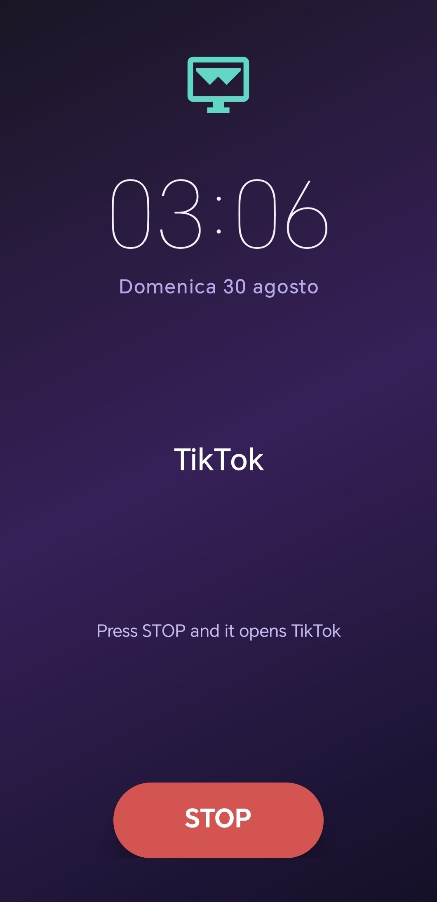

<div align="left">
  
</div>

# DoomClock

> The alarm that **decides what you open next.** 🕰️

A minimal Android alarm clock that **opens the app you choose when you press STOP.** Made with Flutter and native Android (Kotlin). Built to make even the alarm work for you — set the time, pick your poison (TikTok, Instagram, YouTube…), and let the doom begin.

> The core idea: the alarm doesn't just wake you up. It decides what you open next. One alarm, one choice, zero friction.

---

## Features

- **Single, minimal alarm** — time + sound + on/off. No clutter.
- **Open any app on STOP** — pick any installed app; it launches instantly, no confirmation.
- **Live countdown** — the setup screen shows real-time time remaining (days/hours/min/sec, updates every second).
- **Rings with the screen off** — alarm fires at system level, even with the app closed.
- **Lock-screen aware** — if locked at STOP, asks you to unlock first, then shows the dedicated STOP screen.
- **Purple Material 3 UI** — consistent theme, vector icons, no emoji.
- **Android only** — iOS cannot auto-open another app, so it's out of scope.

---

## Screenshots

| | |
|---|---|
| **Setup & live countdown** | **STOP screen** |
|  |  |

---

## How it works

1. Set the alarm time.
2. Toggle it on.
3. Choose the app to open on STOP.
4. When it rings: unlock if needed, press **STOP**.
5. The selected app opens. Enjoy the doom. 🌪️

---

## Technical overview

### Architecture

Flutter drives the UI. The alarm itself runs as a **native Android module** written in Kotlin — it must live outside the Flutter layer because it has to keep working when the app is killed and the screen is off.

```
┌────────────────────────────┐
│  Flutter UI (lib/)         │   setup screen, live countdown
│  └─ MethodChannel bridge   │   ─ schedule / cancel / pick app
└──────────────┬─────────────┘
               │  MethodChannel "doomclock/native"
┌──────────────▼─────────────┐
│  MainActivity.kt (bridge)  │   routes calls to native modules
│  AlarmScheduler.kt         │   schedules/cancels the exact alarm
│  AlarmReceiver.kt          │   fires on time, posts full-screen notification
│  AlarmAlertActivity.kt     │   full-screen alarm UI (locked/unlocked + STOP)
└────────────────────────────┘
```

### Key implementation details

| Concern | How it's solved |
|---|---|
| **Reliable firing with screen off** | `AlarmManager.setExactAndAllowWhileIdle` — exact alarms, ignoring battery optimizations. |
| **Background launch restriction (Android 10+)** | Android forbids starting activities from the background. Alarm apps are expected to use a **`fullScreenIntent` notification** — that's what `AlarmReceiver` posts. |
| **Full-screen permission (Android 14+)** | Requires `USE_FULL_SCREEN_INTENT`; on 14+ the user must opt in from system settings. The app detects it via lifecycle and presents a banner with a shortcut to settings. |
| **Waking with screen off** | `FLAG_KEEP_SCREEN_ON` + `FLAG_TURN_SCREEN_ON` + `setShowWhenLocked(true)` on the alert activity. |
| **Lock-screen flow** | A runtime `BroadcastReceiver` on `ACTION_USER_PRESENT` detects unlock. Two-state UI: *locked → unlock prompt* (no STOP), *unlocked → single STOP button* that opens the app. |
| **App picking** | Queries `queryIntentActivities(ACTION_MAIN, CATEGORY_LAUNCHER)` for installed apps, cached in `MainActivity`. |
| **Launch on STOP** | `getLaunchIntentForPackage` + `FLAG_ACTIVITY_NEW_TASK` launched from an unlocked foreground context, so it always succeeds. |

### Native modules

| File | Role |
|---|---|
| `MainActivity.kt` | Flutter ↔ native bridge (MethodChannel `doomclock/native`) |
| `AlarmScheduler.kt` | Wraps `AlarmManager` schedule/cancel + exact-alarm permission checks |
| `AlarmReceiver.kt` | BroadcastReceiver: builds the full-screen alarm notification |
| `AlarmAlertActivity.kt` | Full-screen alarm UI with lock/unlock two-state logic |

### MethodChannel API (`doomclock/native`)

`scheduleAlarm`, `cancelAlarm`, `hasExactAlarmPermission`, `requestExactAlarmPermission`, `requestNotificationPermission`, `hasFullScreenIntentPermission`, `openFullScreenSettings`, `pickApp`, `openApp`, `getAlarmRingtone`.

---

## Build

Requires Flutter SDK + Android SDK (JDK 17+).

```bash
flutter pub get
flutter build apk --release --target-platform android-arm64
```

Output: `build/app/outputs/flutter-apk/app-release.apk`

**Permissions on first launch:** exact alarms, notifications, and full-screen (Android 14+, from settings).

---

## License

Personal project by **Flame0510**. Free to use for personal purposes.

---

*DoomClock — the alarm that decides what you open next.*
